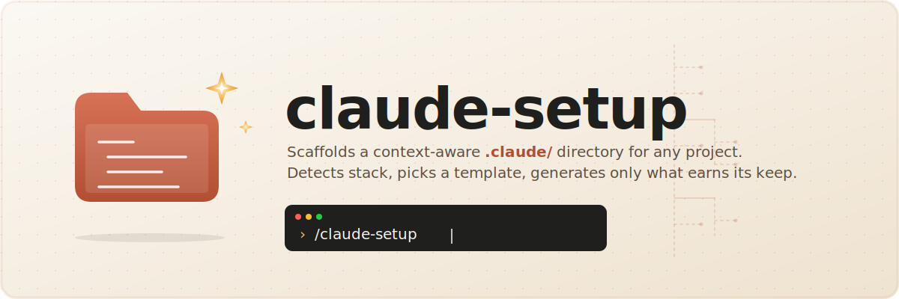

<p align="center">
  
</p>

<p align="center">
  <a href="LICENSE"></a>
  <a href="https://github.com/sir-ad/claude-setup-skill/stargazers"></a>
  <a href="https://github.com/sir-ad/claude-setup-skill/commits/main"></a>
  
  
  <a href="https://code.claude.com"></a>
</p>

<p align="center">
  <strong>One slash command. A bespoke <code>.claude/</code> per project.</strong><br/>
  <em>Detects language, framework, monorepo layout, and existing conventions —<br/>
  generates only the files that earn their keep on this stack.</em>
</p>

<p align="center">
  No empty folders &nbsp;·&nbsp; No placeholder TODOs &nbsp;·&nbsp; No copy-paste from docs examples
</p>

---

## Install

```sh
git clone https://github.com/sir-ad/claude-setup-skill ~/claude-setup-skill
cd ~/claude-setup-skill
./install.sh
```

That symlinks `~/.claude/skills/claude-setup/` → `~/claude-setup-skill/`. Edit the source in this repo; changes are live.

## Use

In any project:

```sh
cd ~/some-new-project
claude
> /claude-setup
```

Optional flags:

| Flag | Effect |
|---|---|
| `--minimal` | only `CLAUDE.md` + `.claude/settings.json` |
| `--skip-skills` | skip skill generation |
| `--dry-run` | print the plan, write nothing |

The skill walks five phases:

1. **Detect** — reads README, lockfiles, manifests, existing `.claude/`.
2. **Match template** — picks one of `templates/<stack>.md` as the reference.
3. **Plan** — prints what it'll write; asks before clobbering.
4. **Generate** — writes files with project-specific substitutions.
5. **Verify** — prints final tree, line counts, and one verification step.

## What it generates (when applicable)

| File | When |
|---|---|
| `CLAUDE.md` | always |
| `.worktreeinclude` | always |
| `.claude/settings.json` | always |
| `.claude/rules/<n>.md` | per significant subdir with distinct conventions |
| `.claude/agents/<lang>-reviewer.md` | always (read-only review subagent) |
| `.claude/skills/release/` | if version file + `CHANGELOG.md` exist |
| `.claude/skills/<other>/` | per detected workflow (db-migrate, preview-deploy, etc.) |

What it **never** generates:

- `.claude/output-styles/` — no use-case-off-the-shelf
- `.claude/commands/` — Anthropic docs recommend skills for new workflows
- `.claude/agent-memory/` — auto-populated when subagents with `memory:` frontmatter run
- Empty folders
- Skills with TODO bodies
- Hard rules invented from thin air (only pulled from README / RFCs / ADRs)

## Stacks supported

| Stack | Template |
|---|---|
| Rust workspace | `templates/rust-workspace.md` |
| Rust single crate | `templates/rust-single.md` |
| Node monorepo (npm / pnpm / yarn workspaces, turbo, nx, lerna) | `templates/node-monorepo.md` |
| Node single (Next.js, Vite, Astro, Express, ...) | `templates/node-single.md` |
| Python (Poetry, uv, pip, hatch, rye) | `templates/python.md` |
| Go | `templates/go.md` |
| Anything else | `templates/generic.md` |

To add a stack: drop a new `templates/<name>.md`, then add a detection branch in `SKILL.md` Phase 2.

## Worked example

See [`examples/acme-saas.md`](./examples/acme-saas.md) for what the skill produces on a real-world Node monorepo (pnpm + turbo + Next.js + Hono + Drizzle): which inputs trigger which files, which README phrases get encoded as hard rules, and what the directory looks like in practice.

## Updating

Pull this repo, that's it — the symlink keeps the skill live:

```sh
cd ~/claude-setup-skill
git pull
```

## Uninstalling

```sh
./install.sh --uninstall
```

Removes the symlink. Doesn't touch this repo or any project's `.claude/` directories you've generated.

## Why a skill, not a CLI

A skill is one markdown file Claude reads at runtime. The "context detection" is just Claude reading your project, which is already what Claude does best. A standalone CLI would either need a fixed templating engine (less context-aware) or shell out to the Claude API (more setup). Skill = zero install, maximum context-awareness, one file to maintain.

## License

MIT. See [`LICENSE`](./LICENSE).
