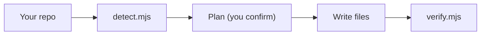
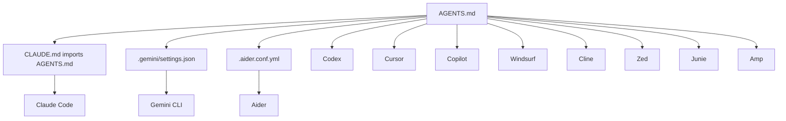
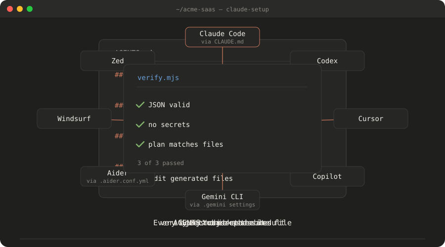

<p align="center">
  
</p>

<p align="center">
  <a href="https://www.npmjs.com/package/@claude-setup-skill/install"></a>
  <a href="https://www.npmjs.com/package/@claude-setup-skill/install"></a>
  <a href="LICENSE"></a>
  <a href="https://github.com/sir-ad/claude-setup-skill/stargazers"></a>
  <a href="https://github.com/sir-ad/claude-setup-skill/commits/main"></a>
  
  <a href="https://code.claude.com"></a>
</p>

**Coding agents guess your build and test commands. This gives every agent the real ones.**

claude-setup detects your stack and writes one `AGENTS.md` with verified commands, hard rules and version notes that your agents read.

## Quick start

1. Install the skill: `npx -y @claude-setup-skill/install`
2. Go to a project folder and run `claude`.
3. Type `/claude-setup`.

To see the plan first, add `--dry-run`. Nothing is written.

## Before / after

Before, a typical hand-written file:

```markdown
# Project notes

- Write clean, readable code.
- Run the tests before you commit.
- Keep functions small.
- Follow the best practices for the framework.
```

After, part of the `AGENTS.md` from [`examples/acme-saas.md`](./examples/acme-saas.md). The project is fictional.

```markdown
# acme-saas

## Commands
- Install: `pnpm install --frozen-lockfile`
- Test: `pnpm test`
- Typecheck: `pnpm run typecheck`

## Hard rules
- "PII never in logs." (README.md:41)

## Version notes
- Next.js 15: `cookies()`, `headers()`, `params` and `searchParams` are async. Await them.
- Turborepo 2: tasks go under `tasks` in `turbo.json`. The old `pipeline` key is gone.
```

## How it works


```mermaid
flowchart LR
  R["Your repo"] --> D["detect.mjs"] --> P["Plan (you confirm)"] --> W["Write files"] --> V["verify.mjs"]
```

1. **Detect.** The detector reads manifests, CI workflows and existing agent files. It never reads `.env` files or lockfile contents.
2. **Load guidance.** The matching template and knowledge notes load into context.
3. **Plan.** The skill prints every file it will write. It asks you to confirm.
4. **Write.** It writes `AGENTS.md` first, then `CLAUDE.md`, `.claude/` and the adapters.
5. **Verify.** `verify.mjs` checks line counts, JSON, secret-like text and the `@AGENTS.md` import.

## One file, every agent

Most agents read `AGENTS.md` directly. Claude Code, Gemini CLI and Aider need a small file that points to it.


```mermaid
flowchart TD
  AG["AGENTS.md"]
  CM["CLAUDE.md imports AGENTS.md"]
  GS[".gemini/settings.json"]
  AC[".aider.conf.yml"]
  CC["Claude Code"]
  GC["Gemini CLI"]
  AI["Aider"]
  CX["Codex"]
  CU["Cursor"]
  CP["Copilot"]
  WS["Windsurf"]
  CL["Cline"]
  ZD["Zed"]
  JN["Junie"]
  AM["Amp"]

  AG --> CM --> CC
  AG --> GS --> GC
  AG --> AC --> AI
  AG --> CX & CU & CP & WS & CL & ZD & JN & AM
```

Copilot chat on github.com reads only `.github/copilot-instructions.md`. The skill does not write that file.

## See it

<p align="center">
  
</p>

<p align="center">
  
</p>

[Try the interactive explorer](https://htmlpreview.github.io/?https://github.com/sir-ad/claude-setup-skill/blob/main/docs/index.html). The explorer is a single HTML file. You can also open `docs/index.html` in a browser.

## What it writes

| File | When |
|---|---|
| `AGENTS.md` | always. Commands, repo map, conventions, hard rules with sources, version notes, boundaries |
| `CLAUDE.md` | always. First line `@AGENTS.md`, then Claude-only lines |
| `.claude/settings.json` | always. Allow rules for your commands, deny rules for destructive commands and secrets |
| `.claude/rules/<n>.md` | per directory with distinct conventions (`paths:` frontmatter) |
| `.claude/agents/<lang>-reviewer.md` | read-only reviewer subagent |
| `.claude/skills/<n>/` | per real workflow, such as release or preview deploy |
| `.worktreeinclude` | when gitignored files such as `.env` need to reach worktrees |
| Adapters | `.gemini/settings.json`, `.aider.conf.yml`, and rule mirrors for Cursor, Copilot, Cline and Windsurf. Only for agents you pick or already use |
| Formatter hook | only if a formatter is detected and you say yes |

It never writes empty folders, placeholder skills or legacy single-file rules.

## Why the output is trustworthy

- **Commands come from your repo.** The detector lists each command with its source, such as `package.json#scripts.*` or a CI workflow. The skill opens those scripts before it writes a command.
- **Hard rules keep their source.** Each rule is quoted in full with its `file:line`. The skill never trims a qualifier such as "unless" or "except".
- **Version notes follow your versions.** A Next.js 15 note appears only when your project declares Next.js 15. Each note links to its upstream source.
- **The plan is a contract.** The skill prints every file before it writes. It then writes exactly those files and reports any drift.
- **verify.mjs checks what was written.** It checks line counts, JSON syntax, secret-like text and the `@AGENTS.md` import. It never prints a matched secret.
- **It never reads `.env` files.** The detector skips them, and the generated settings deny reads of them.

## Flags

| Flag | Effect |
|---|---|
| `--dry-run` | print the plan, write nothing |
| `--minimal` | only `AGENTS.md`, `CLAUDE.md` and `.claude/settings.json` |
| `--skip-skills` | skip skill generation |
| `--agents=<list>` | write adapters for these agents: `claude,codex,cursor,copilot,gemini,aider,cline,windsurf` or `all`. Default is Claude plus any agent whose config already exists |
| `--update` | re-run detection, show a diff against your current files, apply only the hunks you confirm. Your own prose is never rewritten |

To refresh a project you already set up, run `/claude-setup --update` in it.

## Stacks

| Stack | Template |
|---|---|
| Node monorepo (npm / pnpm / yarn workspaces, turbo, nx, lerna) | `templates/node-monorepo.md` |
| Node single (Next.js, Vite, Astro, Express, ...) | `templates/node-single.md` |
| Python (Poetry, uv, pip, hatch, rye) | `templates/python.md` |
| Go | `templates/go.md` |
| Rust single crate | `templates/rust-single.md` |
| Rust workspace | `templates/rust-workspace.md` |
| Java / Kotlin (Maven, Gradle) | `templates/jvm.md` |
| Ruby | `templates/ruby.md` |
| .NET | `templates/dotnet.md` |
| PHP | `templates/php.md` |
| Anything else | `templates/generic.md` |

## Agents

`AGENTS.md` is the shared source of truth. Most agents read it directly.

| Agent | What the skill does |
|---|---|
| Claude Code | `CLAUDE.md` imports `AGENTS.md`, plus `.claude/` extras |
| Codex, Zed, Junie, Amp, Kiro, opencode | nothing extra. They read `AGENTS.md` |
| Cursor, Copilot, Cline, Windsurf | read `AGENTS.md`. Optional mirrors of your `.claude/rules/` for path-scoped rules |
| Gemini CLI | `.gemini/settings.json` so it reads `AGENTS.md` |
| Aider | `.aider.conf.yml` so it reads `AGENTS.md` |

Hazards and details, such as legacy `.cursorrules` files that shadow `AGENTS.md` in Zed, are in [`reference/agent-adapters.md`](./reference/agent-adapters.md).

## Install options

All three put the skill in `~/.claude/skills/claude-setup/`.

```sh
npx -y @claude-setup-skill/install                             # run once
npm i -g @claude-setup-skill/install && claude-setup-install   # keep a command for reruns
```

```sh
git clone https://github.com/sir-ad/claude-setup-skill ~/claude-setup-skill   # from source
cd ~/claude-setup-skill && ./install.sh
```

The npm methods copy files. From source, a symlink points at your clone, so edits take effect at once. Run `git pull` in the clone to update.

## Uninstall

```sh
npx -y @claude-setup-skill/install --uninstall   # npm install
./install.sh --uninstall                         # from source
```

From source, this removes the symlink. It doesn't touch this repo or the files generated in your projects.

## Headless / CI

- `claude -p "/claude-setup --dry-run"` prints the plan and writes nothing.
- For a run that writes files, use interactive mode. In some permission modes, Claude Code refuses writes under `.claude/`. The skill then prints the full content of each refused file in its report. Create those files by hand.
- With `--permission-mode acceptEdits`, Claude Code refuses writes to `.claude/settings.json` and `.claude/rules/`. Expect them in the report, or run interactively.
- If the skill cannot load its context because the skill directory is outside the allowed paths, pass `--add-dir ~/.claude/skills/claude-setup`.

## Contributing

Run `npm run check` to validate the repo files and run the tests. It needs Node 18 or newer and no dependencies. See [CONTRIBUTING.md](./CONTRIBUTING.md) for how to add a stack template or a knowledge note.

## License

MIT. See [LICENSE](./LICENSE).

If this saved you setup time, a star helps others find it.
