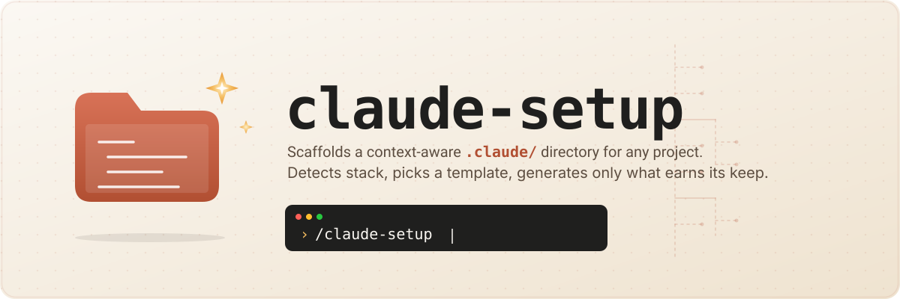

<p align="center">
  
</p>

<p align="center">
  <a href="https://www.npmjs.com/package/@claude-setup-skill/install"></a>
  <a href="https://www.npmjs.com/package/@claude-setup-skill/install"></a>
  <a href="LICENSE"></a>
  <a href="https://github.com/sir-ad/claude-setup-skill/stargazers"></a>
  <a href="https://github.com/sir-ad/claude-setup-skill/commits/main"></a>
  
  <a href="https://code.claude.com"></a>
</p>

<p align="center">
  <strong>One slash command. AGENTS.md for every coding agent, plus Claude Code extras.</strong><br/>
  <em>A small script detects your stack, commands, and existing agent configs.<br/>
  Claude writes only the files that earn their keep on this project.</em>
</p>

<p align="center">
  No empty folders &nbsp;·&nbsp; No placeholder TODOs &nbsp;·&nbsp; No invented commands
</p>

---

## Demo

A `/claude-setup` run on the `acme-saas` Node monorepo (pnpm + turbo + Next.js + Hono + Drizzle). The detector finds the stack from lockfiles and `package.json` workspaces and lists the real commands. The skill keeps the hard rules the README states, then writes `AGENTS.md`, a `CLAUDE.md` that imports it, and a path-scoped `.claude/` tree:

<p align="center">
  
</p>

Each `rules/*.md` is path-scoped (frontmatter `paths:`) so it only enters context when you open a file under that subtree. Skills such as `release` and `preview-deploy` are wired to commands that exist in the repo. No TODO bodies, no docs-example boilerplate.

See [`examples/acme-saas.md`](./examples/acme-saas.md) for the file-by-file breakdown, including which README phrase became which rule.

---

## Install

**Quickest** — zero install, runs once:

```sh
npx -y @claude-setup-skill/install
```

**Global** — keeps a `claude-setup-install` command around to rerun anytime:

```sh
npm i -g @claude-setup-skill/install && claude-setup-install
```

**From source** — for contributing or live-editing the skill:

```sh
git clone https://github.com/sir-ad/claude-setup-skill ~/claude-setup-skill
cd ~/claude-setup-skill && ./install.sh
```

All three populate `~/.claude/skills/claude-setup/`. The npm methods copy files; from-source symlinks them so edits in your clone are immediately live.

## Use

In any project:

```sh
cd ~/some-project
claude
> /claude-setup
```

Optional flags:

| Flag | Effect |
|---|---|
| `--dry-run` | print the plan, write nothing |
| `--minimal` | only `AGENTS.md`, `CLAUDE.md` and `.claude/settings.json` |
| `--skip-skills` | skip skill generation |
| `--agents=<list>` | write adapters for these tools: `claude,codex,cursor,copilot,gemini,aider,cline,windsurf` or `all`. Default is Claude plus any tool whose config already exists |
| `--update` | re-run detection, show a diff against your current files, apply only the hunks you confirm. Your own prose is never rewritten |

## What it writes

| File | When |
|---|---|
| `AGENTS.md` | always. Commands, repo map, conventions, hard rules with sources, version notes, boundaries |
| `CLAUDE.md` | always. First line `@AGENTS.md`, then Claude-only lines |
| `.claude/settings.json` | always. Scoped allow rules, deny rules for destructive commands and secrets |
| `.claude/rules/<n>.md` | per directory with distinct conventions (`paths:` frontmatter) |
| `.claude/agents/<lang>-reviewer.md` | read-only review subagent |
| `.claude/skills/<n>/` | per real workflow (release, preview deploy, migrations) |
| `.worktreeinclude` | when gitignored files such as `.env` need to reach worktrees |
| Adapters | `.gemini/settings.json`, `.aider.conf.yml`, and rule mirrors for Cursor, Copilot, Cline and Windsurf, only for tools you pick or already use |
| Formatter hook | only if a formatter is detected and you say yes |

Version notes come from `knowledge/`: short, cited, version-gated entries (for example, a note about Next.js 15 appears only if your project declares Next.js 15). Your pinned versions always win.

What it never writes:

- `.claude/output-styles/`, `.claude/commands/`, `.claude/agent-memory/`
- Empty folders or skills with TODO bodies
- Commands, rules or version notes it can't trace to your repo or a cited source
- Secrets or `.env` values. It never reads `.env*` files.
- `.junie/AGENTS.md`, legacy single-file rules, or Roo Code files

## Stacks supported

| Stack | Template |
|---|---|
| Node monorepo (npm / pnpm / yarn workspaces, turbo, nx, lerna) | `templates/node-monorepo.md` |
| Node single (Next.js, Vite, Astro, Express, ...) | `templates/node-single.md` |
| Python (Poetry, uv, pip, hatch, rye) | `templates/python.md` |
| Go | `templates/go.md` |
| Rust single crate | `templates/rust-single.md` |
| Rust workspace | `templates/rust-workspace.md` |
| Java / Kotlin (Maven, Gradle) | `templates/jvm.md` |
| Ruby | `templates/ruby.md` |
| .NET | `templates/dotnet.md` |
| PHP | `templates/php.md` |
| Anything else | `templates/generic.md` |

## Agents supported

`AGENTS.md` is the shared source of truth. Most tools read it directly.

| Tool | What the skill does |
|---|---|
| Claude Code | `CLAUDE.md` imports `AGENTS.md`, plus `.claude/` extras |
| Codex, Zed, Junie, Amp, Kiro, opencode | nothing extra. They read `AGENTS.md` |
| Cursor, Copilot, Cline, Windsurf | read `AGENTS.md`. Optional mirrors of your `.claude/rules/` for path-scoped rules |
| Gemini CLI | `.gemini/settings.json` so it reads `AGENTS.md` |
| Aider | `.aider.conf.yml` so it reads `AGENTS.md` |

Details and hazards (for example, legacy `.cursorrules` shadowing `AGENTS.md` in Zed) are in [`reference/agent-adapters.md`](./reference/agent-adapters.md).

## How it works

1. **Detect.** `scripts/detect.mjs` (Node, zero dependencies, read-only) prints JSON: stack, workspaces, framework versions, commands with their sources, existing agent configs, hard-rule candidates. If Node is missing, the skill falls back to reading manifests by hand.
2. **Read guidance.** Picks one of the `templates/` and the matching `knowledge/` notes for your ecosystem.
3. **Plan.** Prints what it will write, the version notes and hard rules it kept, and any hazards. Asks before touching existing files.
4. **Generate.** Writes `AGENTS.md` first, then `CLAUDE.md`, `.claude/`, and adapters.
5. **Verify.** Prints the tree and line counts, checks JSON validity, scans for secrets, optionally runs one fast check (lint, typecheck or a single test) to confirm the commands work, and gives one check per tool (`/memory` in Claude Code, `/memory show` in Gemini CLI).

## Updating

Pull this repo. The symlink keeps the skill live:

```sh
cd ~/claude-setup-skill
git pull
```

To refresh a project you already set up, run `/claude-setup --update` in it.

## Uninstalling

```sh
./install.sh --uninstall
```

Removes the symlink. Doesn't touch this repo or any files you've generated in projects.

## Why a skill, not a CLI

A skill is markdown Claude reads at runtime. Judgment, such as which hard rules are real and which conventions are worth a line, stays with the model, which is already good at reading a project. The parts that must not vary run in a small zero-dependency script: detecting the stack, finding commands, converting rules for other tools. Same repo, same JSON. A standalone CLI would need a fixed templating engine or an API key. A skill needs neither.

## Development

```sh
npm run check    # validate repo files, then run the tests
```

Node 18 or newer, no dependencies. See [`CONTRIBUTING.md`](./CONTRIBUTING.md) for adding a stack template or a knowledge note.

## License

MIT. See [`LICENSE`](./LICENSE).
